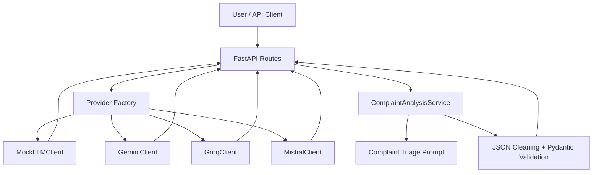
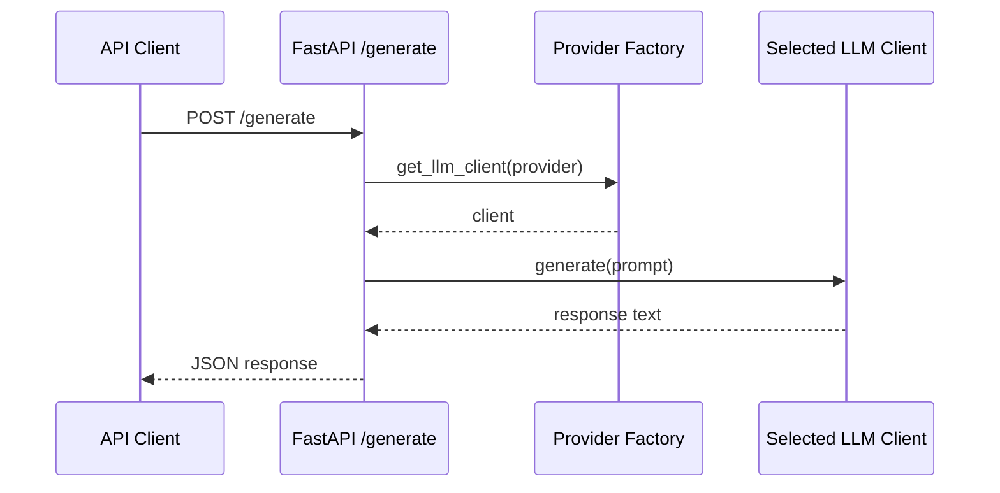
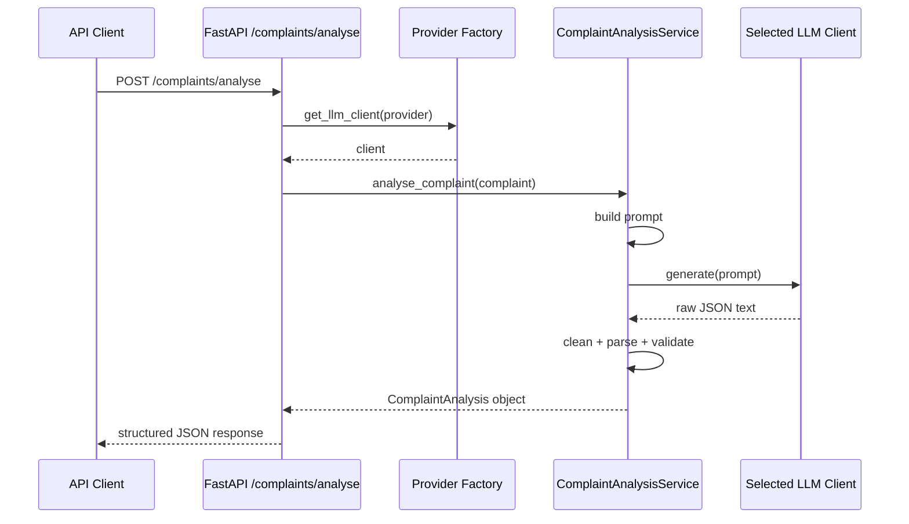

# Architecture

This document explains the architecture of the Multi-Provider LLM Starter Kit.

The goal of the project is to provide a clean foundation for building LLM applications that can switch between providers while keeping the rest of the application logic stable.

## High-Level Architecture



## Main Layers

### 1. API Layer

Location:

```text
src/multi_provider_llm/api/
```

The API layer contains the FastAPI app, request/response schemas, and endpoints.

Current endpoints:

- `GET /health`
- `POST /generate`
- `POST /generate/stream`
- `POST /complaints/analyse`

The API layer should stay thin. It receives requests, calls the correct service or provider, and returns responses.

### 2. Provider Layer

Location:

```text
src/multi_provider_llm/clients/
```

The provider layer contains the LLM clients.

Current clients:

- `MockLLMClient`
- `GeminiClient`
- `GroqClient`
- `MistralClient`

Each client follows the same interface:

```python
generate(prompt: str) -> str
generate_stream(prompt: str) -> Iterator[str]
```

This means the rest of the application does not need to know the internal details of each provider SDK.

### 3. Provider Factory

Location:

```text
src/multi_provider_llm/clients/factory.py
```

The provider factory centralises provider selection.

Instead of manually creating clients throughout the app, the application calls:

```python
client = get_llm_client(provider_name)
```

This makes the app easier to extend. A new provider can be added by creating a new client class and registering it in the factory.

### 4. Prompt Layer

Location:

```text
src/multi_provider_llm/prompts/
```

The prompt layer stores prompt templates separately from the API and provider code.

This keeps prompt engineering visible, reusable, and easier to improve.

### 5. Service Layer

Location:

```text
src/multi_provider_llm/services/
```

The service layer contains business logic.

Current service:

```text
ComplaintAnalysisService
```

This service:

1. builds the complaint triage prompt
2. calls the selected LLM client
3. cleans the response
4. parses JSON
5. validates the output with Pydantic
6. returns a structured complaint analysis object

### 6. Configuration Layer

Location:

```text
src/multi_provider_llm/config.py
```

Configuration is loaded from environment variables.

This keeps API keys, model names, provider settings, token limits, and temperature outside the source code.

### 7. Testing Layer

Location:

```text
tests/
```

The tests use the mock provider instead of real API calls.

This keeps the test suite:

- fast
- deterministic
- safe
- free from live API usage
- suitable for GitHub Actions CI

## Request Flow: Standard Generation



## Request Flow: Complaint Analysis



## Design Principles

### Keep Provider Logic Separate

Provider-specific SDK code should stay inside provider client classes.

The rest of the app should use the common interface.

### Keep API Routes Thin

Routes should not contain complex business logic. They should call services and return responses.

### Use Mock Providers for Tests

Tests should not depend on live LLM APIs by default.

### Validate Structured Outputs

LLM output should not be trusted blindly. It should be parsed, cleaned, and validated before use.

### Do Not Hard-Code Secrets

API keys should come from `.env` locally or environment variables in deployment.

They should never be committed to GitHub or copied into Docker images.

## Future Architecture Extensions

Planned future improvements:

- RAG retrieval layer
- vector database integration
- authentication
- token and cost tracking
- request logging and monitoring
- production deployment
- frontend UI
- workflow automation layer